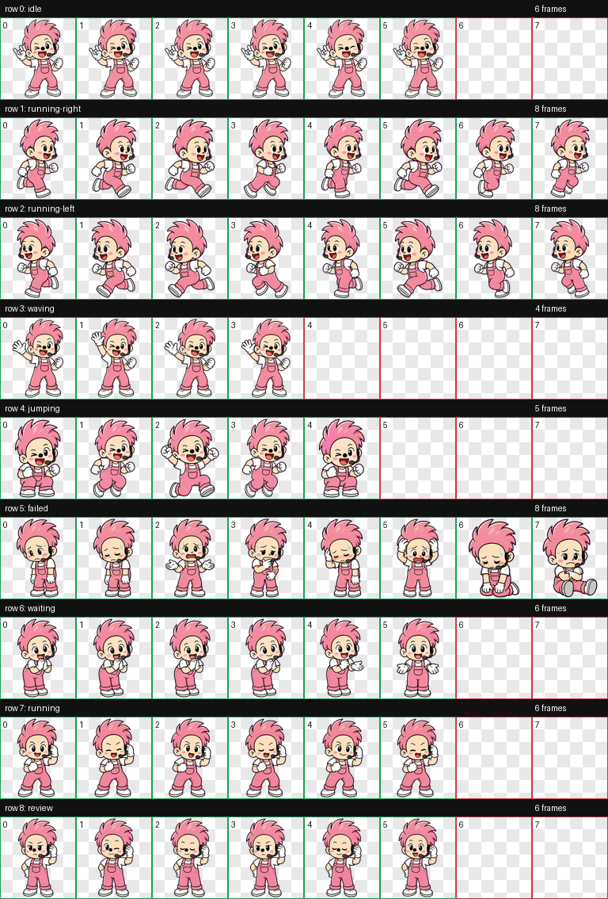

# Codexpet-Pink Soul DT

Pink Soul DT is a chibi Petdex pet inspired by pink soul-stage energy.

## Preview



## Community Page

Pink Soul DT is also available on CodexPet:

https://codexpet.xyz/pets/community/pink-soul-dt/

## Disclaimer

Fan-made project. Not affiliated with or endorsed by David Tao, his label, or any official Soul Power project.

## Petdex Package

This repository contains the two files needed for the pet package:

- `pet.json`
- `spritesheet.webp`

The spritesheet is `1536x1872`, arranged as an `8 x 9` animation atlas. Each frame is `192x208`.

## Animations

The atlas rows are:

1. `idle`
2. `running-right`
3. `running-left`
4. `waving`
5. `jumping`
6. `failed`
7. `waiting`
8. `running`
9. `review`

## Install

Copy this folder into your Codex pets directory:

```text
%USERPROFILE%\.codex\pets\Pink Soul DT
```

Then restart or refresh Codex and select `Pink Soul DT` from the pet list.
